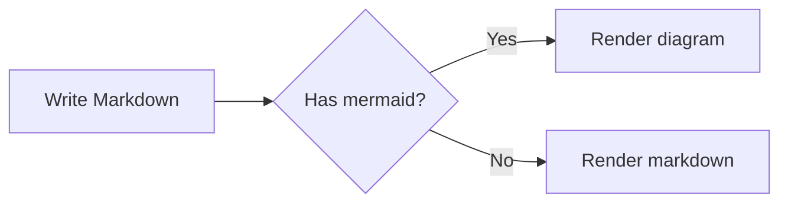
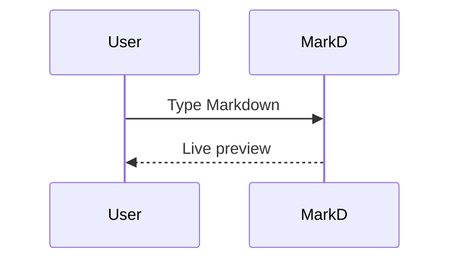

# MarkD

A fast, distraction-free Markdown editor for the desktop — with live preview, resizable split pane, Mermaid diagram rendering, and a rich-text-to-Markdown converter.

Built with Flutter. Targets Windows, macOS, and Linux.

---

## Features

**Editor & Preview**
- Side-by-side split pane with live Markdown preview
- Resizable divider — drag to set any editor/preview ratio
- Full Markdown support: headings, bold, italic, code, tables, blockquotes, links, and more
- Save to `.md` file

**Mermaid Diagrams**
- Fenced ` ```mermaid ``` ` blocks render as live diagrams in the preview
- Supports flowcharts, sequence diagrams, and all other Mermaid diagram types
- Diagrams update automatically as you type (debounced)
- Dark-theme rendering — diagrams blend naturally with the editor UI

**RTF → Markdown Converter**
- Paste rich text or HTML from your clipboard (from Word, Notion, web pages, etc.)
- Converts to clean Markdown instantly
- Copy the result back to clipboard with one click

**UI**
- Dark editorial theme with a Playfair Display / JetBrains Mono / Lora type stack
- Minimal chrome — no distractions, no toolbars in your way

---

## Screenshots

| Editor | Mermaid Diagram |
|--------|----------------|
| Live split-pane preview | Flowchart and sequence diagrams rendered inline |

---

## Requirements

| Platform | Requirement |
|----------|-------------|
| Windows  | Visual Studio 2022+ with **Desktop development with C++** workload |
| macOS    | Xcode + Command Line Tools |
| Linux    | `clang`, `cmake`, `ninja-build`, `pkg-config`, `libgtk-3-dev` |

- Flutter SDK **3.9+**
- Dart SDK **3.9+**
- Internet connection (Mermaid diagrams are rendered via [mermaid.ink](https://mermaid.ink))

---

## Getting Started

```bash
# Clone the repo
git clone https://github.com/your-username/markd.git
cd markd

# Install dependencies
flutter pub get

# Enable desktop targets if needed
flutter config --enable-windows-desktop
flutter config --enable-macos-desktop
flutter config --enable-linux-desktop

# Run in debug mode
flutter run -d windows   # or macos / linux
```

---

## Build

### Windows

```bash
flutter build windows --release
```

Output: `build/windows/x64/runner/Release/`

Distribute the entire `Release` folder or package it with an installer (NSIS, WiX, etc.).

### macOS

```bash
flutter build macos --release
```

Output: `build/macos/Build/Products/Release/MarkD.app`

For distribution outside your own machine, codesign and notarize per Apple requirements.

### Linux

```bash
flutter build linux --release
```

Output: `build/linux/x64/release/bundle/`

Distribute the full `bundle` directory including required shared libraries.

---

## Mermaid Diagram Syntax

Wrap any Mermaid diagram in a fenced code block with the `mermaid` language tag:

````markdown

````

````markdown

````

Diagrams are rendered via [mermaid.ink](https://mermaid.ink) — a public, open-source Mermaid rendering service. An internet connection is required for this feature.

---

## Dependencies

| Package | Purpose |
|---------|---------|
| [flutter_markdown](https://pub.dev/packages/flutter_markdown) | Markdown parsing and rendering |
| [google_fonts](https://pub.dev/packages/google_fonts) | Playfair Display, JetBrains Mono, Lora, DM Sans |
| [file_selector](https://pub.dev/packages/file_selector) | Native save-file dialog |
| [super_clipboard](https://pub.dev/packages/super_clipboard) | Rich-text clipboard access |
| [html2md](https://pub.dev/packages/html2md) | HTML → Markdown conversion |
| [http](https://pub.dev/packages/http) | Mermaid diagram HTTP requests |

---

## License

MIT
